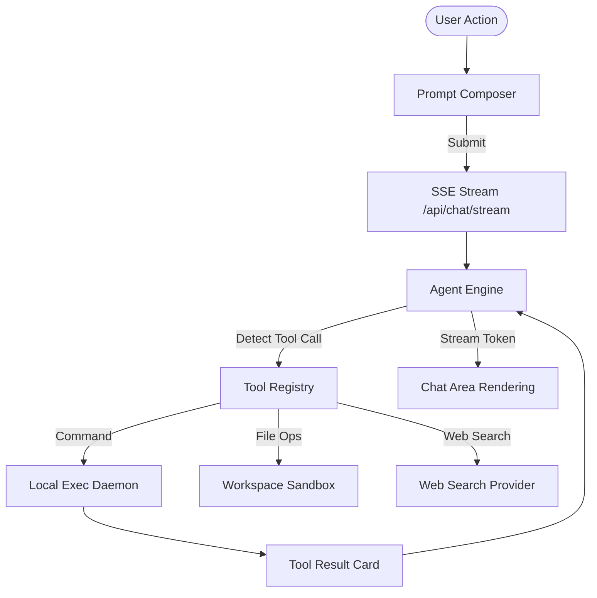

# GROKBOT-RE: Interaction Map

```mermaid
flowchart TD
    User([User Action]) --> Input[Prompt Composer]
    Input -->|Submit| Stream[SSE Stream /api/chat/stream]
    Stream --> Engine[Agent Engine]
    Engine -->|Detect Tool Call| Registry[Tool Registry]
    Registry -->|Command| Daemon[Local Exec Daemon]
    Registry -->|File Ops| FS[Workspace Sandbox]
    Registry -->|Web Search| DuckDuckGo[Web Search Provider]
    Daemon --> Result[Tool Result Card]
    Result --> Engine
    Engine -->|Stream Token| UI[Chat Area Rendering]
```
